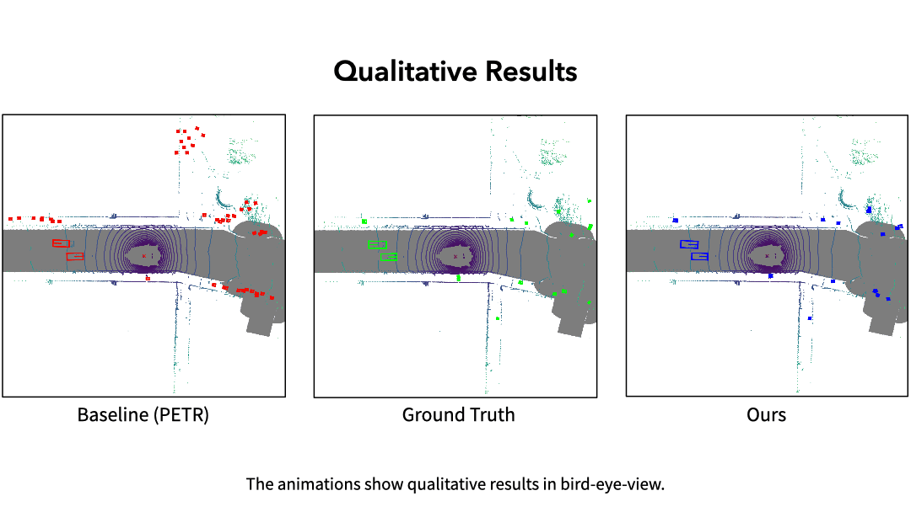

# CrossDTR: Cross-view and Depth-guided Transformers for 3D Object Detection 
## Demo Video

<!--  -->
<!--  -->

<!-- <iframe width="560" height="315" src="https://www.youtube.com/embed/_5kscaGVDu0" title="CrossDTR: Cross-view and Depth-guided Transformers for 3D Object Detection" frameborder="0" allow="accelerometer; autoplay; clipboard-write; encrypted-media; gyroscope; picture-in-picture" allowfullscreen></iframe> -->
<!-- [Direct Link to video](https://youtu.be/_5kscaGVDu0) -->

## News
- [2022/09/28] CrossDTR is released on arxiv.

## Abstract
To achieve accurate 3D object detection at a low cost for autonomous driving, many multi-camera methods have been proposed and solved the occlusion problem of monocular approaches. However, due to the lack of accurate estimated depth, existing multi-camera methods often generate multiple bounding boxes along a ray of depth direction for difficult small objects such as pedestrians, resulting in an extremely low recall. Furthermore, directly applying depth prediction modules to existing multi-camera methods, generally composed of large network architectures, cannot meet the real-time requirements of self-driving applications. To address these issues, we propose Cross-view and Depth-guided Transformers for 3D Object Detection, CrossDTR. First, our lightweight depth predictor is designed to produce precise object-wise sparse depth maps and low-dimensional depth embeddings without extra depth datasets during supervision. Second, a cross-view depth-guided transformer is developed to fuse the depth embeddings as well as image features from cameras of different views and generate 3D bounding boxes. Extensive experiments demonstrated that our method hugely surpassed existing multi-camera methods by 10 percent in pedestrian detection and about 3 percent in overall mAP and NDS metrics. Also, computational analyses showed that our method is 5 times faster than prior approaches. Our codes will be made publicly available at https://github.com/sty61010/CrossDTR. 
## Methods

## Visualization
### Camera View
<!--  -->
<!--  -->
<!--  -->
<!--  -->

### Bird Eye View
<!--  -->
<!--  -->
<!--  -->
<!--  -->
<!--  -->

## Getting Started
- The code is coming soon.
